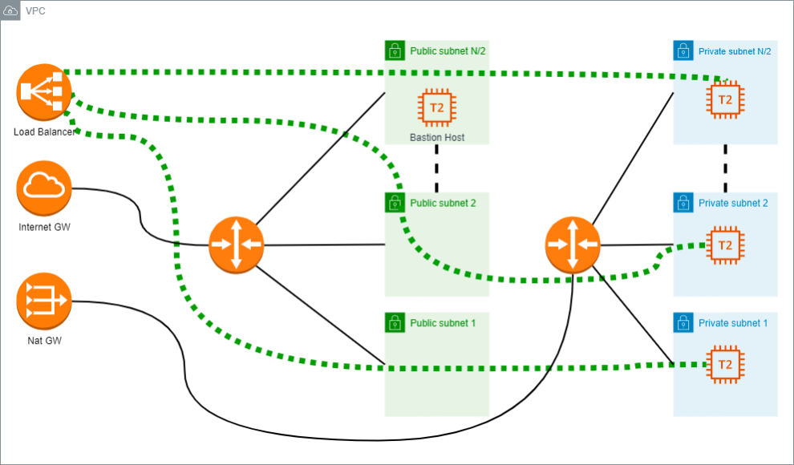

# Terraform AWS Challenge

The challenge is to create an AWS infrastructure, using IaC to match the following diagram:



## Requirements

- Two types of subnets should exist:
  - Public subnets. Attached instances and resources have public IP addresses.
  - Private subnets. Attached instances and resources don’t have public IP addresses.
- The total number of private subnets that must exist is N/2, and the total number of public subnets must also be N/2 where N is the maximum number of subnets that can exist in the VPC and N will always be less than or equal to 6.  Each private subnet will have a T2.micro instance attached, and one attached bastion host (also T2.micro) on one of the public subnets (any public subnet). The bastion host (a.k.a. Jump Server) will be used to connect to other instances on private subnets by SSH connection. All instances must use the same SSH key pairs to log in.
- The Internet Outbound for the instances on private subnets will be reached using a NAT Gateway. The instances on public subnets can connect through an Internet Gateway or NAT Gateway whichever the candidate prefers.
- Finally, an Application Load Balancer (a.k.a. ALB) will be used to forward all HTTP traffic to all instances working on private subnets by round-robin balancing. However, the ALB will have to be attached to each public subnet.
- Once an HTTP connection is attempted to the public DNS created in the creation of this exercise, the following message should be response:

```html
“Hello World at <date>”
```

- The <date> clause must be replaced by the date of creation of the golden image.

## Code Organization

The code is organized in the following way:

```asciidoc
main
├── docs
│   └── images
├── modules
│   ├── golden_image
│   │   └── packer
│   ├── instances
│   └── network
└── results

9 directories

```

- `main` is the root module, which is the entry point for the Terraform execution.
- `docs` contains the documentation for the project.
- `modules` contains the modules used by the root module.
  - `modules/golden_image` contains the Packer template to create the golden image.
    - `modules/golden_image/packer` contains the Packer template to create the golden image.
  - `modules/instances` contains the Terraform code to create the instances.
  - `modules/network` contains the Terraform code to create the network.
- `results` contains the results of the execution of the root module.

## Execution

The execution of the root module is dependant on the following variables:

```terraform
# The number of subnets to create (must be >= 2 and <= 6)
N_Subnets = 5

# Base name for the resources created by this module
Name = "ffbdev"

# The network IP address configuration on CIDR format
Network_CIDR = "10.35.0.0/16"

# Tags to apply to the resources created by this module
Tags = {
  "owner" = "Frederico Freire Boaventura"
  "environment" = "staging"

}

# Path to the Manifest file generated by Packer
# May be relative to the root module or absolute path to the actual file.
Manifest_path = "./resources/manifest.json"

```

### Results

The files that will be saved to the `results` directory are:

- `manifest.json` is the Packer manifest file.
- `${var.Name}-key.pem` is the private key to connect to the instances, which can also be .

<!-- BEGIN_TF_DOCS -->

# AWS Infrastructure

This is the main Terraform file for the AWS infrastructure.

This module will call the following modules:

 - Network
 - Golden Image
 - Instances

## Usage

 ```bash
   make apply
 ```

## Providers

| Name | Version |
|------|---------|
| <a name="provider_http"></a> [http](#provider\_http) | n/a |
| <a name="provider_local"></a> [local](#provider\_local) | n/a |

## Requirements

| Name | Version |
|------|---------|
| <a name="requirement_terraform"></a> [terraform](#requirement\_terraform) | >= 1.4.0 |
| <a name="requirement_aws"></a> [aws](#requirement\_aws) | 5.0.1 |

## Inputs

| Name | Description | Type | Default | Required |
|------|-------------|------|---------|:--------:|
| <a name="input_Manifest_path"></a> [Manifest\_path](#input\_Manifest\_path) | Path to the Packer resulting manifest.json file | `string` | n/a | yes |
| <a name="input_N_Subnets"></a> [N\_Subnets](#input\_N\_Subnets) | The number of subnets to create | `number` | n/a | yes |
| <a name="input_Name"></a> [Name](#input\_Name) | Base name for the resources | `string` | n/a | yes |
| <a name="input_Network_CIDR"></a> [Network\_CIDR](#input\_Network\_CIDR) | The network IP address configuration on CIDR format | `string` | n/a | yes |
| <a name="input_Tags"></a> [Tags](#input\_Tags) | Tags to apply to the resources | `map(string)` | `{}` | no |
| <a name="input_local_ip"></a> [local\_ip](#input\_local\_ip) | Local IP address to allow SSH access | `string` | `""` | no |
| <a name="input_vpc_id"></a> [vpc\_id](#input\_vpc\_id) | VPC ID to deploy the builder instance | `string` | `""` | no |

## Outputs

| Name | Description |
|------|-------------|
| <a name="output_Bastion_Host_IP"></a> [Bastion\_Host\_IP](#output\_Bastion\_Host\_IP) | Bastion Host public IP address |
| <a name="output_Load_blanacer_HTTP_Content"></a> [Load\_blanacer\_HTTP\_Content](#output\_Load\_blanacer\_HTTP\_Content) | Load balancer public DNS name |
| <a name="output_Private_instances_IP_addresses"></a> [Private\_instances\_IP\_addresses](#output\_Private\_instances\_IP\_addresses) | Private IP addresses of instances |
| <a name="output_SSH_key_content"></a> [SSH\_key\_content](#output\_SSH\_key\_content) | SSH key content |
| <a name="output_Usernames"></a> [Usernames](#output\_Usernames) | Usernames for instances |

## Modules

| Name | Source | Version |
|------|--------|---------|
| <a name="module_golden_image"></a> [golden\_image](#module\_golden\_image) | ./modules/golden_image | n/a |
| <a name="module_instances"></a> [instances](#module\_instances) | ./modules/instances | n/a |
| <a name="module_network"></a> [network](#module\_network) | ./modules/network | n/a |

## Resources

| Name | Type |
|------|------|
| [local_file.golden_image](https://registry.terraform.io/providers/hashicorp/local/latest/docs/resources/file) | resource |
| [local_file.network](https://registry.terraform.io/providers/hashicorp/local/latest/docs/resources/file) | resource |
| [http_http.local_ip](https://registry.terraform.io/providers/hashicorp/http/latest/docs/data-sources/http) | data source |


<!-- END_TF_DOCS -->

## Known Issues

- Sometimes the Golden Image creation process fails due to some Ubuntu update/upgrade/install errors. 
    If this happens, you can try to run the process again and it will probably work.
